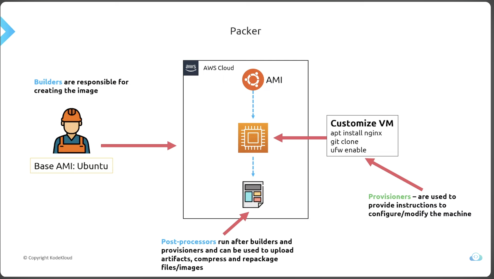
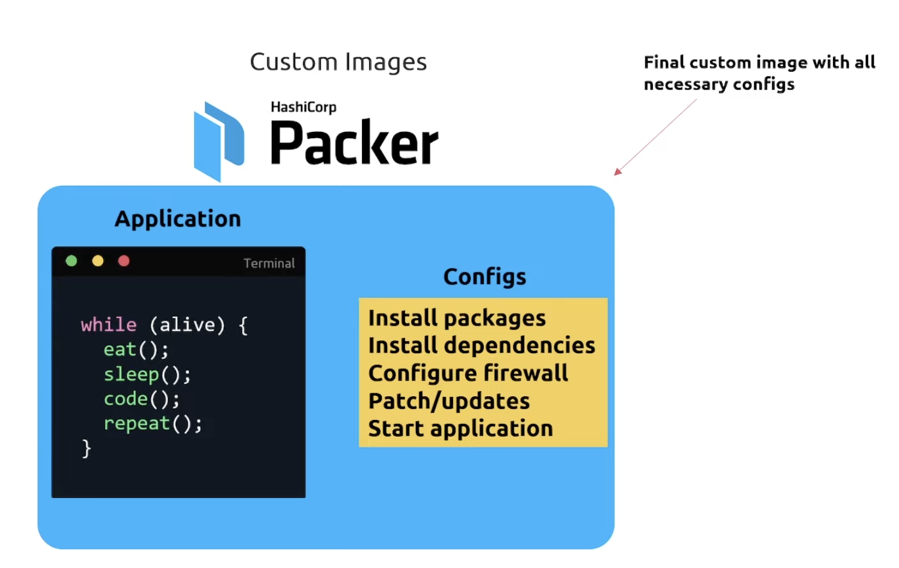

# 1. What is 'Packer'
## GOAL: How we take an Infrastructure of code approach to building and maintaining our production artifacts we run
- Builder + Provisioner + Post-Provisioner

# 2. Mutable Infrastructure
- Process: Code -> Deploy -> Configure
- Worry about 'Drift': It's hard to manage the integratity when you deploy the changes of server configurations to be patched
- 
# 3. Immutable Infrastructure
- Process: Code -> Configure -> Deploy
# 4. Custom Image
- hello

