# 1. Compute Service Full Landscape
```
AWS Compute Services
        │
        ├── Virtual Machines
        │     └── EC2
        │
        ├── Containers
        │     ├── ECS (Fargate / EC2)
        │     ├── EKS
        │     └── App Runner
        │
        ├── Serverless Functions
        │     └── Lambda
        │
        ├── Edge Computing
        │     └── Lambda@Edge / CloudFront Functions
        │
        └── Specialized
              ├── Lightsail
              ├── Batch
              └── Outposts
```

# 2. EC2
## 2.1 What it is?
- Virtual Machine in the Cloud
- You get a server and install anything you want on it
## 2.2 How it works?
1. Provision EC2 instance
2. Install OS, runtime, dependencies
3. Deploy your application
## 2.3 What you Manage
patching, scaling, monitoring, availabiltiy
## 2.4 When to Use EC2?
### Use EC2 when:
- Legacy application that can't be containerized
- Need specific OS configuration / kernel tuning
- Require persistent local storage (NVMe SSD)
- GPU workloads (ML training, rendering)
- Bring your own license (Windows Server, Oracle)
- Need SSH access to debug
- Compliance requires dedicated hardware
- Long-running workloads (24/7 steady traffic)
### Don't use EC2 when:
- You want to avoid managing OS/patching
- Traffic is unpredictable or spiky
- Team doesn't have SysAdmin expertise
- Starting a new greenfield project
# 3. Lambda
## 3.1 What it is?
- Serverless Functions
- Upload code, AWS runs it. No servers, no containers — just code.
## 3.2 Limits To Know
```
Timeout:        15 minutes maximum
Memory:         128MB — 10GB
CPU:            proportional to memory
Storage:        512MB — 10GB /tmp
Concurrency:    1,000 per region (default, increasable)
Package size:   50MB zipped, 250MB unzipped
Cold start:     100ms — 1s (Python/Node faster, Java slower)
```
## 3.3 When to Use Lambda
### Use Lambda when:
- Event-driven processing (file upload, DB change, queue)
- Unpredictable or spiky traffic
- Short-lived operations (< 15 min)
- API backends with low-medium traffic
- Scheduled jobs (cron)
- Microservices with independent scaling needs
- Startup / prototype (zero infrastructure cost)
- Webhooks and callbacks

### Don't use Lambda when:
- Need persistent in-memory state (trading engine)
- Long-running jobs (> 15 min)
- WebSocket connections (persistent)
- Cold start latency is unacceptable
- Need predictable, consistent latency
- Large runtime dependencies (slow cold start)
- High sustained throughput (EC2 may be cheaper)
# 4. ECS
## 4.1 What it is?
- Managed container orchestration
- You provide Docker containers, AWS runs them.
```
ECS Launch Types:
  Fargate → AWS manages the host (serverless containers)
  EC2     → You manage the host (containers on your EC2)
```
## 4.2 How It Works
```
You define:
  Task Definition (what to run — image, CPU, memory, env vars)
  Service (how many tasks, load balancer, auto scaling)
        │
        ▼
Fargate: AWS picks a host, runs your container
EC2:     Your EC2 instances run your containers
        │
        ▼
ECS manages: scheduling, health checks, replacements
You manage: application code, task definitions
```

## 4.3 Fargate vs EC2 Launch Type
```
ECS Fargate                       ECS EC2
───────────                       ────────
No EC2 instances to manage        You manage EC2 fleet
Pay per task (vCPU + memory)      Pay for EC2 instances
Shared host (noisy neighbor risk) You control the host
Fast to get started               More configuration needed
Good for: most microservices      Good for: GPU, custom AMI,
                                            cost optimization
                                            at large scale
```
## 4.4 When to Use ECS
### Use ECS when:
- Running Docker containers
- Don't want Kubernetes complexity
- Team is familiar with containers but not K8s
- Simple microservice architecture
- Web applications, APIs, background workers
- Need more control than Lambda
- Long-running containerized workloads
- Batch jobs in containers

### Don't use ECS when:
- Need advanced scheduling (bin packing, topology)
- Require node-level isolation (use EKS + taints)
- Team already knows Kubernetes
- Need StatefulSets for stateful workloads
- Multi-cluster or hybrid cloud requirements
# 5. EKS
## 5.1 What it is?
- Managed Kubernetes
- Full Kubernetes control plane managed by AWS — you manage worker nodes and workloads.
## 5.2 How it works?
### AWS manages:
- Control plane (API server, etcd, scheduler)
- Control plane HA across AZs
- Kubernetes version upgrades
### You manage:
- Worker nodes (EC2 or Fargate)
- Node groups and scaling
- Kubernetes manifests (deployments, services, etc.)
- Add-ons (networking, storage, monitoring)
## 5.3 EKS Specific Capabilities
- **StatefulSets**: stable pod identity across restarts
- **DaemonSets**: run on every node (logging, monitoring)
- **Node Taints**: dedicated nodes for specific workloads
- **Pod Affinity**: control where pods land
- **RBAC**: fine-grained access control
- **Custom CRDs**: extend Kubernetes API
- **Helm Charts**: package management
- **Service Mesh**: Istio/Linkerd for mTLS, traffic management
## 5.4 When to Use EKS
### Use EKS when:
- Team already knows Kubernetes
- Need StatefulSets (databases, matching engines)
- Need node-level isolation (taints)
- Complex scheduling requirements
- Hybrid / multi-cloud strategy
- Large scale (100s of microservices)
- Need service mesh (Istio)
- Advanced networking requirements
- Stateful workloads needing stable identity
### Don't use EKS when:
- Small team without Kubernetes expertise
- Simple applications
- Kubernetes overhead not justified
- Startup with limited DevOps capacity
- Short-lived or event-driven workloads
# 6. App Runner
## 6.1 What it is?
- The simplest way to run a containerized web service. 
- Point at a container image or source code — App Runner handles everything else.
## 6.2 How it works?
### You Provide:
- Container Image
- Source Code
### App Runner Handles:
- Deployment
- Load Balancing
- Auto Scaling(to zero)
- HTTPS/SSL
- Health Checks
- Zero Downtime Deploys
## 6.3 When to Use App Runner?
### Use App Runner when:
- Simple web service or API
- No DevOps expertise on team
- Want fastest path from code to URL
- Prototype / MVP
- Internal tools
- Small-medium traffic
### Don't use App Runner when:
- Need custom networking (VPC control)
- Complex multi-service architectures
- Need persistent storage
- Need specific instance types
- Cost optimization at scale
- Advanced scaling rules
# 7. Lambda@Edge / CloudFront Functions
## 7.1 What it is?
- Run code at the edge
- in CloudFront's 400+ global locations, as close to users as possible.
```
Without edge compute:
  User in Seoul → request → us-east-1 (Lambda) → response
  Round trip: 200-300ms

With Lambda@Edge:
  User in Seoul → request → Seoul CloudFront PoP → response
  Round trip: 5-10ms
```
## 7.2 Two Options
### CloudFront Functions
#### Characteristics:
- Sub-Millisecond
- JavaScript Only
- Very limited (2MB)
- Viewer request/response only
- Cheapest
- Simple Transforms only
#### Use For:
- URL Rewriters
- Header Manipulation
- Simple Redirects
- Bot Detection
### Lambda@Edge
#### Charactersitcis:
- Millisecond latency
- Node.js or Python
- More Capable (128MB - 10GB)
- All CloudFront 4 events
- More expensive
- Complex logic
### Use For:
- Auth at Edge
- A/B testing
- Dynamic Content
- Image Transformation
## 7.3 When to Use?
### Use Lambda@Edge when:
- Personalization per user location
- Auth/authorization at edge (before origin)
- A/B testing without origin involvement
- Dynamic image resizing/optimization
- Reducing load on origin servers
- Bot detection and filtering

### Don't use when:
- Need VPC resources (no VPC access)
- Need more than 30 seconds timeout
- Need persistent state
- Simple static content (no compute needed)

# 8. Batch
## 8.1 What it is?
- Managed batch computing
— run large-scale parallel jobs without managing infrastructure.
```
You submit jobs
        │
        ▼
Batch provisions optimal EC2/Fargate capacity
        │
        ▼
Runs your jobs in parallel
        │
        ▼
Terminates instances when done
You pay: only while jobs run
```
## 8.2 When to Use?
### Use Batch when:
- ML model training jobs
- Video/image processing pipelines
- Financial risk calculations
- Genomics / scientific computing
- ETL data processing
- Rendering jobs
- Any embarrassingly parallel workload
### Don't use when:
- Real-time or low-latency required
- Short jobs (< 1 min) — Lambda is better
- Interactive workloads
# 9. LightSail
## 9.1 What it is?
- Simplified VPS
- EC2 with a simplified interface, fixed pricing, and batteries included.
## 9.2 How it works?
```
Lightsail includes out of the box:
  VM + SSD storage + transfer + DNS + static IP
  All for one fixed monthly price ($3.50 — $160/month)
  Pre-built blueprints: WordPress, LAMP, Node.js, etc.
```
### Use Lightsail when:
- WordPress / CMS hosting
- Simple websites
- Developer unfamiliar with AWS
- Predictable, simple workloads
- Very small budget
- Don't need AWS service integrations

### Don't use when:
- Need tight AWS integrations (IAM, VPC, etc.)
- Need auto scaling
- Need more than basic monitoring
-Production business applications